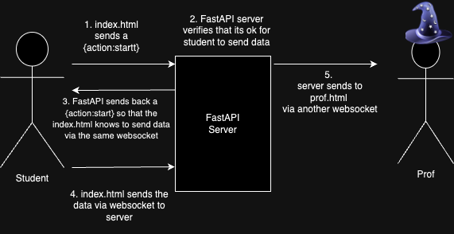

# Usage

## To run the code:
`python3 -m venv venv`

`source venv/bin/activate`

`pip install requirements.txt`

`fastapi dev server.py`

Our code utilizes the pyaudio library. To use it, you have to install the portaudio library.

for windows:
`sudo apt-get install portaudio19-dev`

for mac:
`brew install portaudio`

### For Developers
`pip freeze > requirements.txt` everytime there is updates to the requirements

`fastapi dev server.py`

## Current Progess
[x] Sending over textual data
[x] Established page with prof side, able to see data from student to prof page

[ ] Need to send over actual audio data
[ ] Need to get the students name at the start of loading the client
